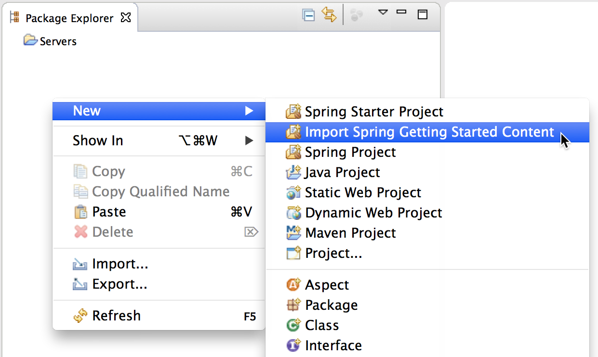
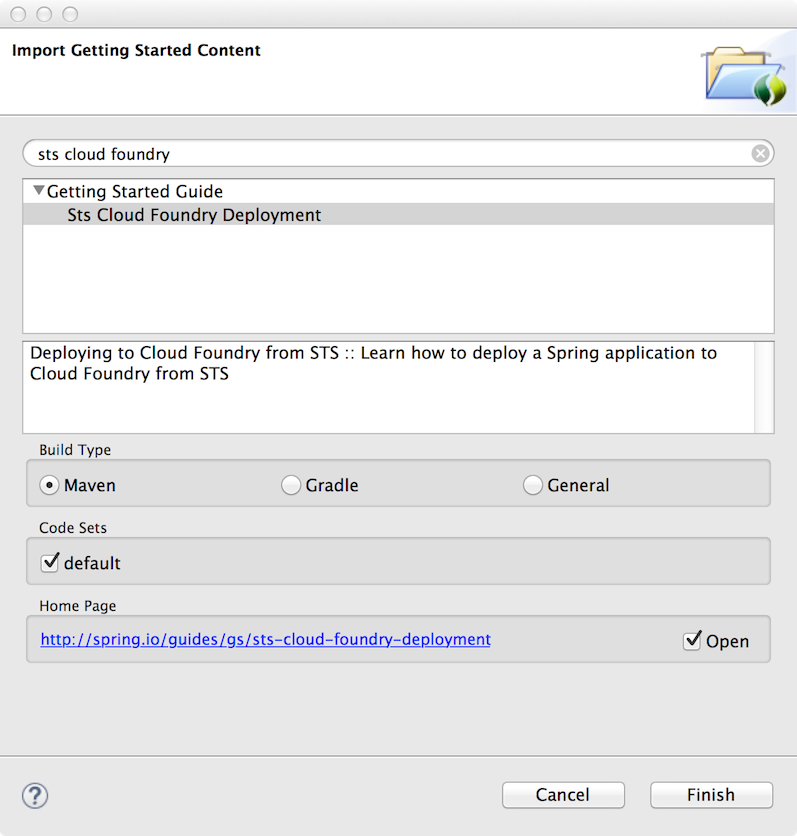
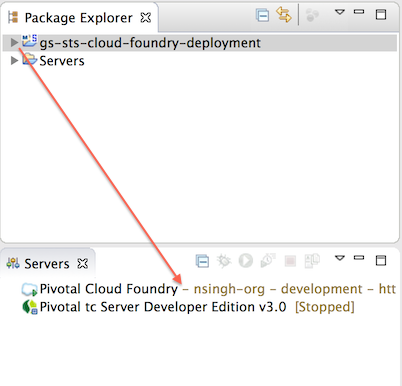

:spring_version: current
:jdk: https://www.oracle.com/technetwork/java/javase/downloads/index.html
:spring_boot_version: 1.5.3.RELEASE
:pws: https://try.run.pivotal.io/sts-guide

:toc:
:icons: font
:source-highlighter: prettify
:project_id: gs-sts-cloud-foundry-deployment
This guide walks you through the process of deploying a "hello world" Spring application to Cloud Foundry from Spring Tool Suite (STS).

== What You'll Deploy to Cloud Foundry

You'll deploy a Spring Boot application to Cloud Foundry that will accept HTTP GET requests at:

    https://gs-sts-cloud-foundry-deployment-myname.cfapps.io/greeting
  
The application URL will vary depending on the host portion that you have to change later on in this guide.

The application will then respond with a web page displaying a greeting:

    "Hello, World!"

You can customize the greeting with an optional `name` parameter in the query string:

    https://gs-sts-cloud-foundry-deployment-myname.cfapps.io/greeting?name=User

The `name` parameter value overrides the default value of "World" and is reflected in the response:

    "Hello, User!"
   
IMPORTANT: The `myname` portion of the URL is what you will change when you deploy your application to Cloud Foundry through STS, to avoid host-taken errors during deployment.
    
This application is based on a Spring service that serves web content. Further information on how to create the service from scratch can be found at
https://spring.io/guides/gs/serving-web-content/[Serving Web Content with Spring MVC], or it can be imported into STS through the https://spring.io/guides/gs/sts/[Import Spring Getting Started Content wizard].

== What You'll Need

 - About 15 minutes
 - https://spring.io/tools/sts/all[Spring Tool Suite (STS)]
 - {jdk}[JDK 8] or later
 - {pws}[Pivotal Web Services (PWS) account]
 - https://docs.spring.io/sts/nan/v373/NewAndNoteworthy.html#bootdash[Spring Boot Dashboard]

== Installing STS
If you don't have STS installed yet, visit the link up above. From there, you can download a copy for your platform. To install it simply 
unpack the downloaded archive.

When you're done, go ahead and launch STS.

== Spring Boot Dashboard
The Spring Boot Dashboard is what you will use to deploy your application to Cloud Foundry, and is included in STS version 3.7.1 or higher. It is required for this guide.

== Creating a Cloud Foundry Target

You first need to create a target to a Cloud Foundry organization and space where you would like to deploy your application. 

To create a Cloud Foundry target, first open the Boot Dashboard view.

You can click on the Boot Dashboard button in the main STS toolbar:

image::images/boot_dashboard_view_main_toolbar.png[STS Toolbar]

Or you can open it through the Eclipse Show View menu:

Window -> Show View -> Other -> Spring -> Boot Dashboard

Once visible, click on the '+' button on the top right of the Boot Dashboard toolbar to open the Cloud Foundry Target wizard.

image::images/boot_dashboard_view_basic.png[Boot Dashboard]

In the wizard, enter your PWS credentials, and click "Select Space" to select a Cloud Foundry organization and space to connect to.
Once a space is selected, click "Finish" to create the target.

image::images/add_cf_target.png[Select Space]

The target will now appear in the Boot Dashboard.

== Import the Sample Spring Application

Now you can import a Spring Boot application that serves web content. You will be deploying this to Cloud Foundry. 

In STS, open the "Import Spring Getting Started Content" wizard:

In the search field, enter "sts cloud foundry" and the sts-cloud-foundry-deployment guide should appear.

- Select the build type.
- Select the "default" code set.
- Click "Finish".

The import wizard will create a new project in your workspace called "gs-sts-cloud-foundry-deployment".

== Deploying to Cloud Foundry

Now simply drag and drop the project to your Cloud Foundry target in the Boot Dashboard.

This will open the deployment manifest dialogue. Boot Dashboard uses Cloud Foundry manifest.yml to specify deployment details for your application, 
including the application name, host, memory, and services to bind. 

You can either use an existing manifest.yml file that you have added to your Spring Boot project, 
or you can select "manual" to use default values generated by the dialogue. 

In manual mode, no manifest.yml file is created in your project.

IMPORTANT: To ensure that the URL for the application has not yet been taken by another application, and avoid host-taken errors during deployment, 
specify a different host in the manifest.yml editor inside the dialogue.

image::images/deployment_manifest.png[Deployment Manifest Dialogue]

Once you have finished configuring your application, click "OK" to complete the deployment.

The deployment may take some time, but as the application is being deployed and started, the application's console will automatically open and indicate progress. 
Both the console and the Boot Dashboard view will show when the application has successfully started and is running. The Boot Dashboard icon for the application will turn into a green "up" arrow.

image::images/console_application_running.png[Console]

== Test the Application

Now that your application is running on Cloud Foundry, you can open the application's web site within STS by double-clicking on the application in the Boot Dashboard. 
This will open a default web browser.

In the browser, append:

/greeting 

to the application URL, and you will see the application page show:

    "Hello, World!"

Provide a `name` query string parameter and append it to the URL in the browser:

/greeting?name=User. 

Notice how the message changes from "Hello, World!" to "Hello, User!":

    "Hello, User!"
    

== Summary

Congratulations! You have just deployed your Spring Boot application to Cloud Foundry.
