:spring_version: current
:jdk: http://www.oracle.com/technetwork/java/javase/downloads/index.html
:spring_boot_version: 1.1.10.RELEASE
:gs-serving-web-content: link:/guides/gs/serving-web-content

:toc:
:icons: font
:source-highlighter: prettify
:project_id: gs-sts-cloud-foundry-deployment
This guide walks you through the process of deploying a "hello world" Spring application to Cloud Foundry from Spring Tool Suite.

== What you'll deploy to Cloud Foundry

You'll deploy a Spring application to Cloud Foundry that will accept HTTP GET requests at:

    http://gs-sts-cloud-foundry-deployment-yourname.cfapps.io/greeting

and respond with a web page displaying a greeting:

    "Hello, World!"

You can customize the greeting with an optional `name` parameter in the query string:

    http://gs-sts-cloud-foundry-deployment-yourname.cfapps.io/greeting?name=User

The `name` parameter value overrides the default value of "World" and is reflected in the response:

    "Hello, User!"
    
The `yourname` portion of the URL is what you will specify when you deploy your application to Cloud Foundry through STS.
    
This application is based on an Spring service that serves web content. Further information on how to create the service from scratch can be found at
{gs-serving-web-content}[Serving Web Content with Spring MVC], or it can be imported into STS through the Getting Started Guide Import Wizard.

== What you'll need

 - About 15 minutes
 - http://spring.io/tools/sts/all[Spring Tool Suite (STS)]
 - {jdk}[JDK 7] or later
 - http://docs.run.pivotal.io/starting/index.html#signup[Pivotal Web Services (PWS) account]
 - http://docs.run.pivotal.io/buildpacks/java/sts.html[Cloud Foundry Eclipse]

== Installing STS
If you don't have STS installed yet, visit the link up above. From there, you can download a copy for your platform. To install it simply 
unpack the downloaded archive.

When you're done, go ahead and launch STS.

== Installing Cloud Foundry Eclipse
If you are using STS version 3.6.3 or higher, Cloud Foundry Eclipse comes pre-installed, and you can skip this step. 

Otherwise, in STS, go to Window -> Install New Software.

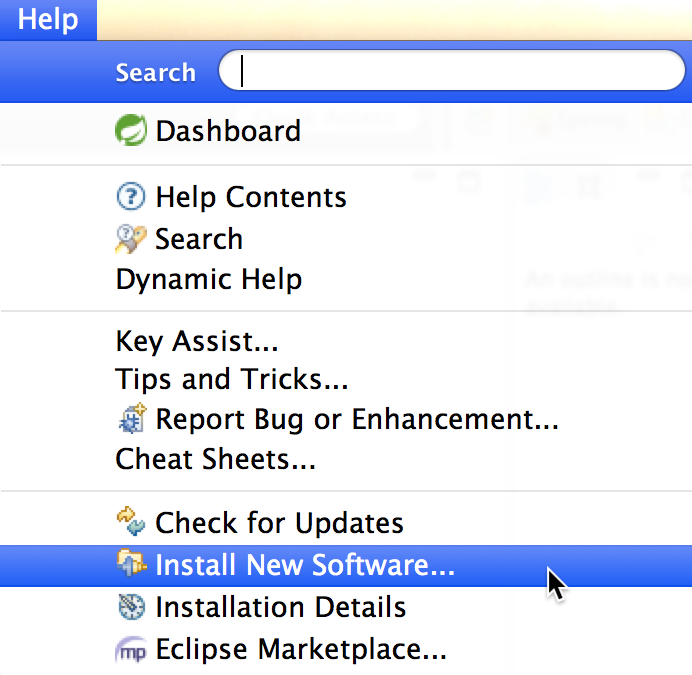

In the Install dialogue, enter the following software installation URL for Cloud Foundry Eclipse:

http://dist.springsource.com/release/TOOLS/cloudfoundry

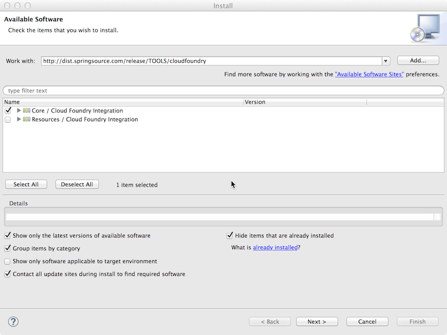

Select the plug-in from the list and continue with the wizard until completion.

After Cloud Foundry Eclipse is installed, you will have to restart STS.

== Creating a Server Instance to Cloud Foundry

With Cloud Foundry Eclipse installed, you must first specify a target Cloud space where you would like to deploy
your application. This is known as a "server instance", which is a local representation of your target space.

To create a Cloud Foundry server instance, open the Eclipse Servers view from the Window -> Show View menu, and then right-click on the view and select:

New -> Server

image::images/servers_view.png[New Server Menu]

Select Cloud Foundry under "Pivotal", and either keep the default server instance name or enter a new one.

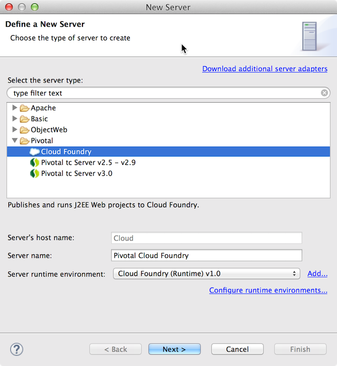

Go to the next page and enter your username and password for your Pivotal Web Services account. Note that you must have http://docs.run.pivotal.io/starting/index.html#signup[an 
account registered] as a prerequisite to deploying your application to PWS.

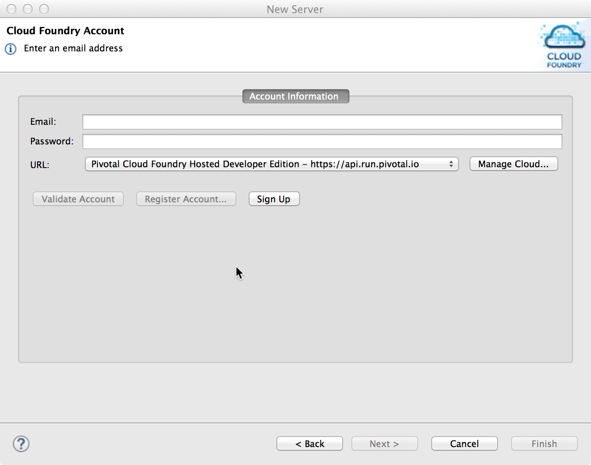

After entering your credentials, select "Next" to navigate to the following page, which will automatically attempt to validate your username and password. The subsequent page will display
the organizations and spaces in your account. Select the target space for your deployment. In this guide we select a deployment 
space.

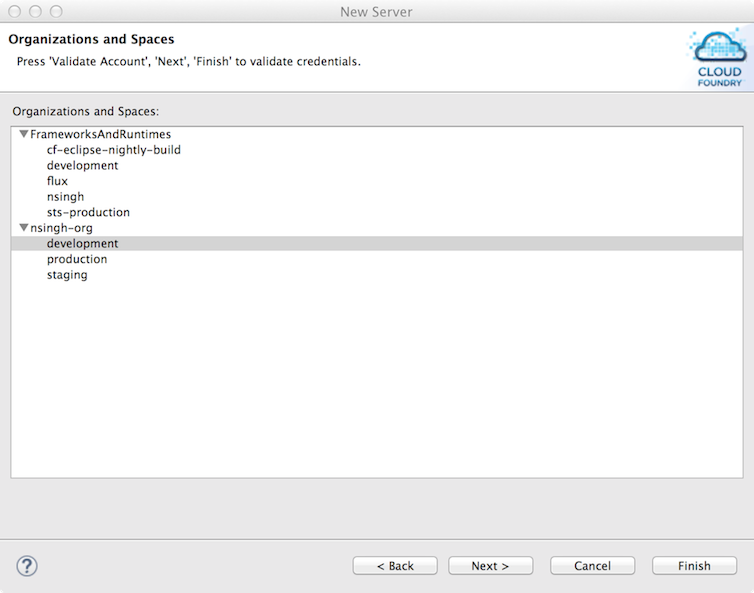

Click "Finish" to complete the server instance creation, which will then show in the Servers view.

== Create a Spring Serving-Web-Content Application

Now we will create a Spring application that serves web content. In STS, open the "Import Spring Getting Started Content" wizard:

image::images/import_gsg.png[Import Getting Started]

In the search field, enter "sts cloud foundry" and the sts-cloud-foundry-deployment guide should appear. The wizard may take a few
moments to download the content for the guide. 

image::images/import_gsg_wizard.png[Import Getting Started Wizard]

Once the download is completed:

- Select the build type.
- Select the "default" code set.
- Click "Finish".

The import wizard will create a new project in your workspace called "sts-cloud-foundry-deployment".

== Deploying to Cloud Foundry

To deploy to Cloud Foundry, your Spring project has to first be configured for deployment through a simple step.
In the Eclipse Package or Project Explorer, right-click on your Spring project, and select:

Configure -> Enable as Cloud Foundry App

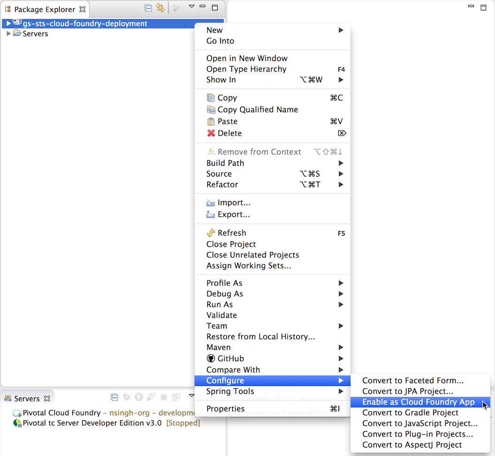

Now simply drag and drop the project to your server instance in the Servers view.

image::images/drag_drop.png[Drag and Drop]

This will open the application deployment wizard with default values for your application, like the
application name, URL, and memory.

To ensure that the URL for the application has not yet been taken by another deployment of the same application, you can either:

- Append a word after the default application name, like your name.

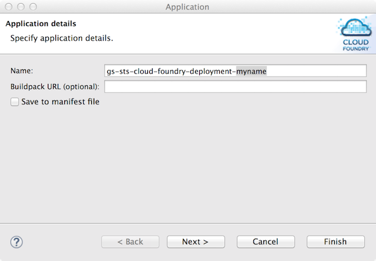

- Or, optionally, you can click "Next" and further configure the application by specifying your own URL.

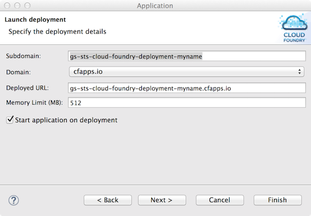

The second page also allows you to adjust the application's memory. Further pages in the wizard also allow you
to bind services and define environment variables.

Once you have finished configuring your application, click "Finish" to complete the deployment.

The deployment may take some time, but as the application is being deployed and started, the application's
console will automatically open and indicate progress.

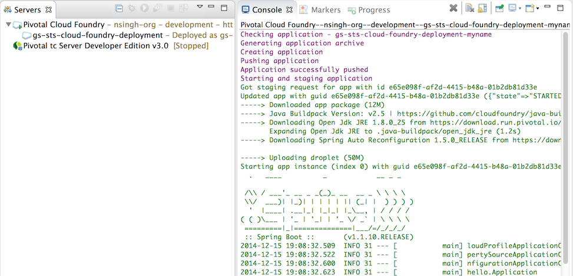

The application's logs will automatically be streamed to the console and will indicate when the application has
finished staging and is now running.

The application will also appear under the server instance in the Servers view.

== Test the service

Now that your application is running on Cloud Foundry, you can open the application's web site within STS by
right-clicking on the application in the Servers view and selecting "Open Home Page".

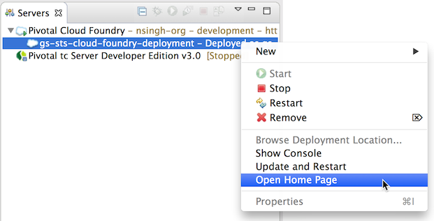

In the browser, visit http://gs-sts-cloud-foundry-deployment-yourname.cfapps.io/greeting
, where you see:

    "Hello, World!"

Provide a `name` query string parameter with http://gs-sts-cloud-foundry-deployment-yourname.cfapps.io/greeting?name=User. Notice how the message changes from "Hello, World!" to "Hello, User!":

    "Hello, User!"

== Application Health and Scaling

You can check your application's health as well as scale your application's memory and instances by double-clicking
on the application in the Servers view. This opens the Cloud Foundry server instance editor.

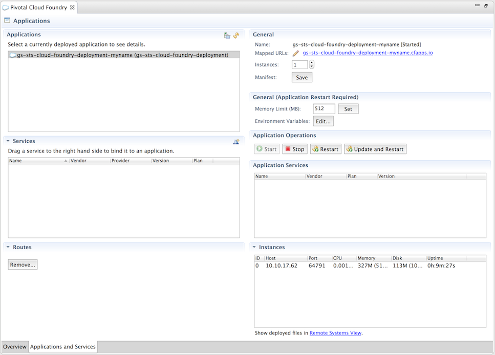

== Summary

Congratulations! You have just developed your Spring application to Cloud Foundry.
